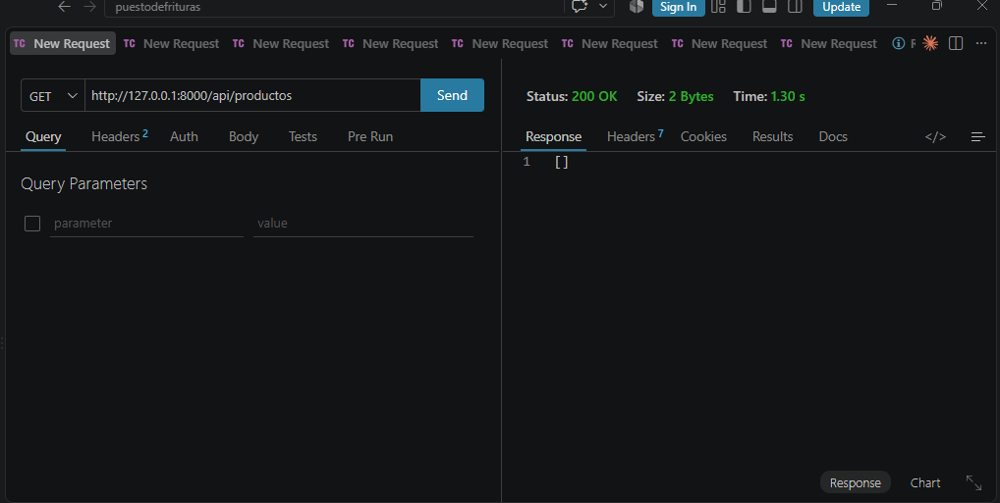
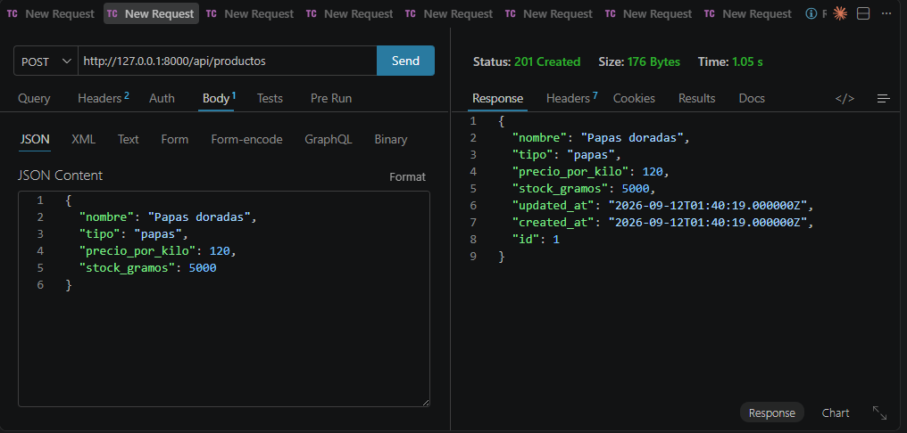
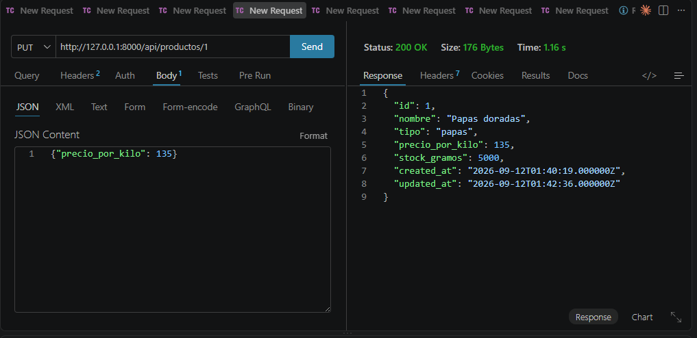
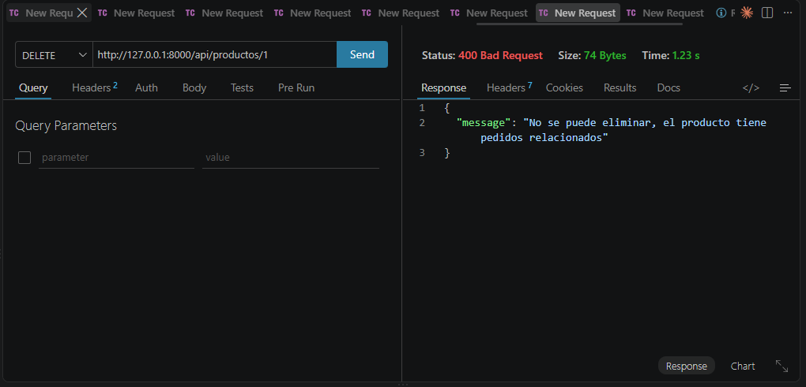
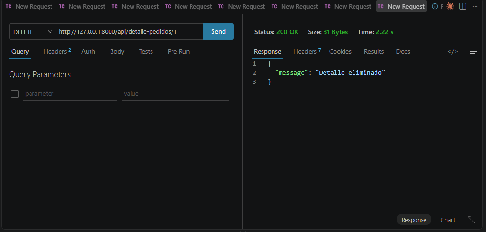
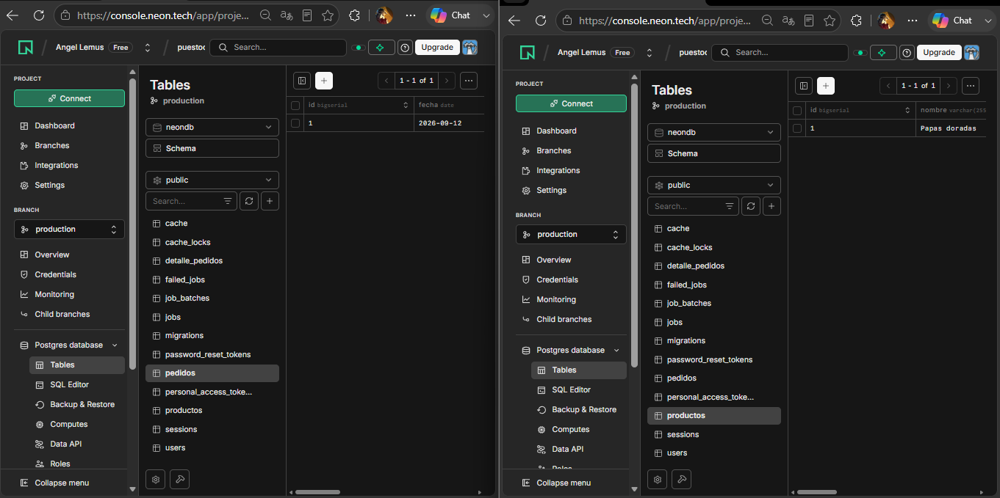

# Puesto de Frituras

API REST desarrollada con Laravel para la gestión de un puesto de frituras (papas doradas, duritos, etc.) que vende por kilos y gramos. Proyecto para la materia de Bases de Datos en la Nube.

## Tecnologías

- Laravel 12
- PostgreSQL (Neon, base de datos en la nube)
- Eloquent ORM

## Modelo de datos

3 tablas relacionadas:

- **productos**: catálogo de productos con precio por kilo y stock en gramos
- **pedidos**: pedidos realizados, con su total acumulado
- **detalle_pedidos**: detalle de cada pedido, conecta productos con pedidos (relación N:M implementada como tabla intermedia), calcula el subtotal automáticamente y descuenta stock

### Diagrama Entidad-Relación


## Instalación

1. Clonar el repositorio
   ```bash
   git clone https://github.com/LemusGoetia/Puesto-de-Frituras.git
   cd Puesto-de-Frituras
   ```

2. Instalar dependencias
   ```bash
   composer install
   ```

3. Copiar el archivo de entorno y generar la key
   ```bash
   cp .env.example .env
   php artisan key:generate
   ```

4. Configurar las variables de base de datos en `.env`
   ```
   DB_CONNECTION=pgsql
   DB_HOST=tu_host_de_neon
   DB_PORT=5432
   DB_DATABASE=tu_base_de_datos
   DB_USERNAME=tu_usuario
   DB_PASSWORD=tu_password
   DB_SSLMODE=require
   ```

5. Correr las migraciones
   ```bash
   php artisan migrate
   ```

6. Levantar el servidor
   ```bash
   php artisan serve
   ```

## Endpoints

Base URL: `http://127.0.0.1:8000/api`

| Método | Endpoint | Descripción |
|---|---|---|
| GET | /productos | Lista todos los productos |
| POST | /productos | Crea un producto |
| GET | /productos/{id} | Consulta un producto |
| PUT | /productos/{id} | Actualiza un producto |
| DELETE | /productos/{id} | Elimina un producto (rechaza si tiene pedidos relacionados) |
| GET | /pedidos | Lista todos los pedidos |
| POST | /pedidos | Crea un pedido |
| GET | /pedidos/{id} | Consulta un pedido con sus detalles y productos |
| PUT | /pedidos/{id} | Actualiza un pedido |
| DELETE | /pedidos/{id} | Elimina un pedido y sus detalles |
| GET | /detalle-pedidos | Lista todos los detalles |
| POST | /detalle-pedidos | Agrega un producto a un pedido (calcula subtotal, descuenta stock, suma al total del pedido) |
| GET | /detalle-pedidos/{id} | Consulta un detalle |
| PUT | /detalle-pedidos/{id} | Actualiza la cantidad de un detalle |
| DELETE | /detalle-pedidos/{id} | Elimina un detalle (regresa el stock y resta el total) |

Todos los endpoints requieren el header `Accept: application/json`.

## Evidencias de prueba

Pruebas realizadas con Thunder Client.

**GET /productos**



**POST /productos**



**PUT /productos/{id}**



**DELETE /productos/{id} — rechazado por integridad referencial**



**DELETE /detalle-pedidos/{id}**



## Base de datos en la nube

